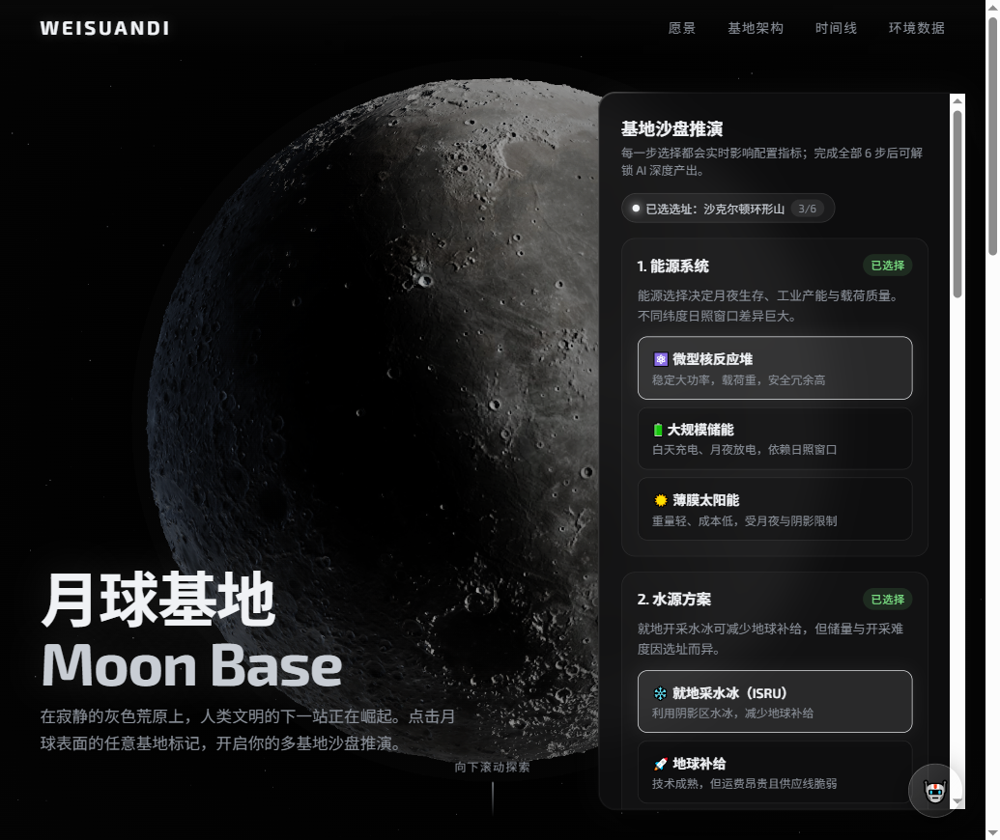
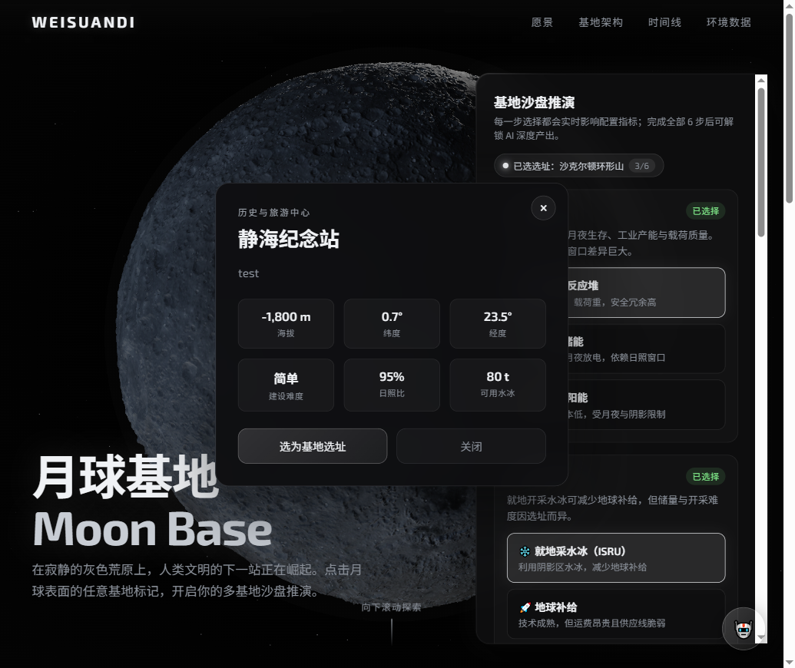
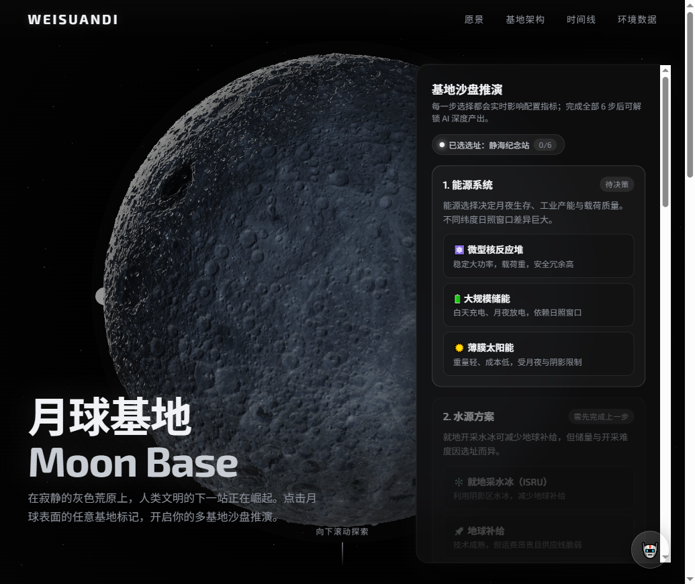
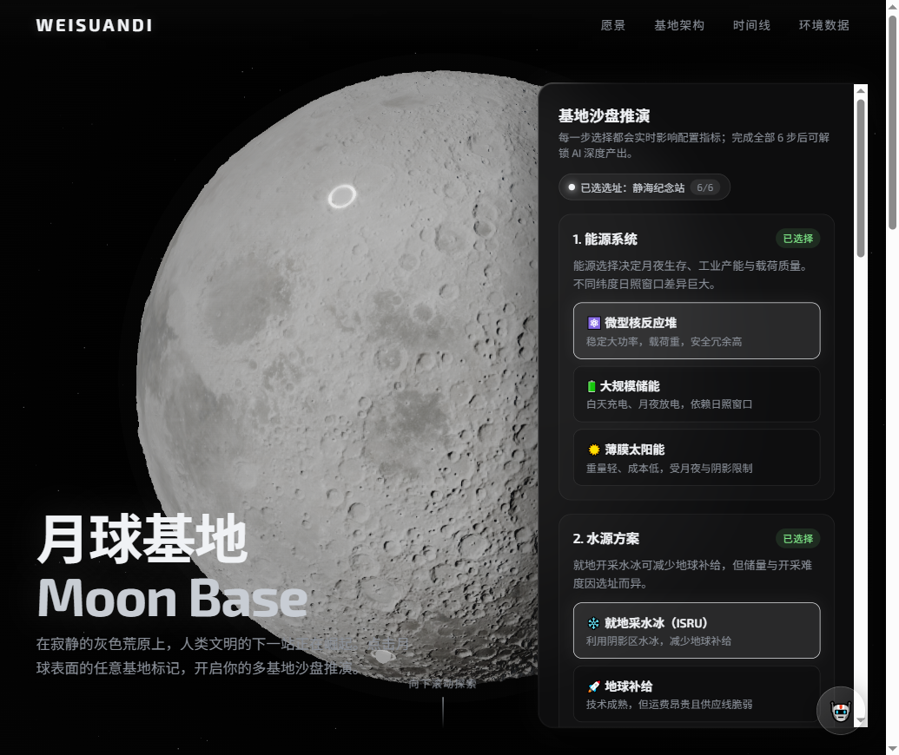
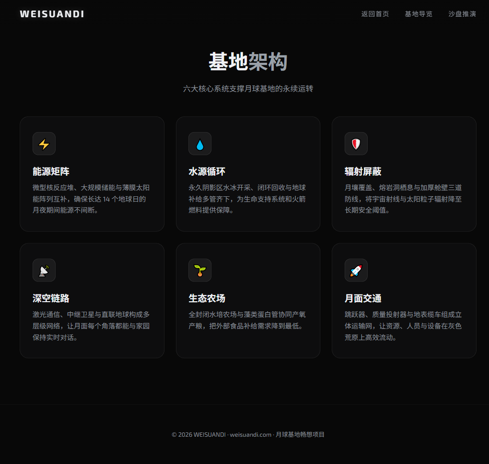
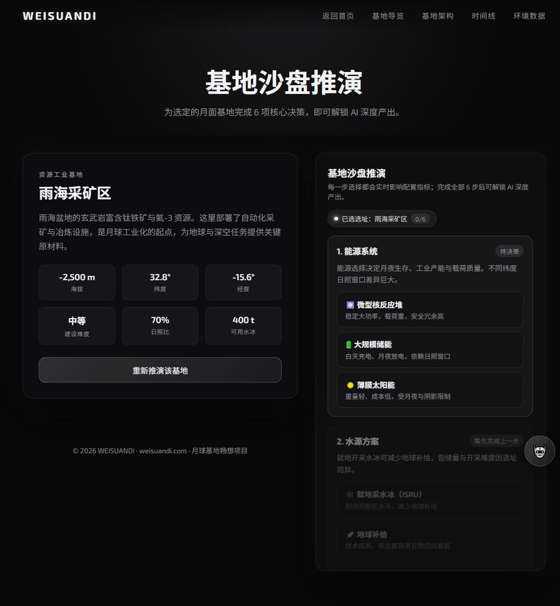

<div align="center">

# 🌙 月球基地畅想 · Moon Base

> **在寂静的灰色荒原上，人类文明的下一站正在崛起。**

[](https://vercel.com)
[](https://threejs.org)
[](https://fastapi.tiangolo.com)
[](https://deepseek.com)

[🚀 在线体验](https://weisuandi.com) · [📖 项目文档](./AIcoding/项目架构分析.md) · [🎮 开始推演](./plan.html)



</div>

---

## ✨ 这是什么？

**月球基地畅想** 是一个关于"未来月球基地建设"的交互式网页作品 / 轻量沙盒游戏。

进入首页，你会看到一颗可交互的 **3D 月球**。月球表面漂浮着基于真实地名命名的基地标记：

- 🏔️ **沙克尔顿基地** — 南极永久阴影区水冰
- 🌊 **静海纪念站** — 人类首次登月点
- ⛏️ **雨海采矿区** — 钛铁矿与氦-3 资源
- 🔭 **第谷观测台** — 深空观测平台

点击选址后，进入**沙盘推演**：为基地选择能源、水源、辐射防护等方案，每一步选择都会通过前端规则表实时计算后果。最终还能生成一份属于你的 **AI 可行性简报**。

> **核心气质**：用户自己拍板，前端把"你这么选会怎样"算给你看。AI 是增强，不是主角。

---

## 🎮 核心体验

| 步骤 | 画面 | 说明 |
|------|------|------|
| **① 仰望月球** |  | 可旋转、缩放、悬停查看标记的 3D 月球 |
| **② 选址决策** |  | 点击标记，查看基地特点并确认选址 |
| **③ 沙盘推演** |  | 能源 → 水源 → 辐射防护，三步决策 |
| **④ 查看结果** |  | 实时指标面板 + AI 可行性简报 |

---

## 🛠️ 技术栈

```
┌─────────────────────────────────────────────────────────┐
│  前端（浏览器）            后端（Vercel Serverless）      │
│  ─────────────────         ───────────────────────────   │
│  Three.js  r128            FastAPI (Python)              │
│  原生 ES Modules           OpenAI SDK → DeepSeek API     │
│  纯 CSS / CSS Variables    完全无状态设计                 │
│  localStorage 状态持久化                                 │
└─────────────────────────────────────────────────────────┘
```

| 层级 | 技术 | 说明 |
|------|------|------|
| 🎨 3D 渲染 | Three.js + EffectComposer | 颜色贴图 + 位移贴图 + UnrealBloomPass 辉光 |
| ⚛️ 前端逻辑 | 原生 ES Module JS | 无框架，轻量直接 |
| 💅 样式 | 纯 CSS | 深空主题 + Glassmorphism 玻璃拟态 |
| 🤖 AI 能力 | DeepSeek `deepseek-chat` | 开放式追问 + 可行性简报生成 |
| 🚀 部署 | Vercel | 静态托管 + Serverless Function |

---

## 🏗️ 架构哲学

判断一段逻辑该不该用 LLM，只问一句话：

> **"如果把 LLM 删掉，这部分会不会坏掉？"**

- **会坏 → 用 agent**：开放式追问、生成式产出
- **不会坏 → 写死**：菜单、数值计算、状态更新、渲染

所以这个项目的前端游戏本体**不依赖 AI 也能完整运行**；AI 只负责两处增强：

1. 💬 `/api/agent` —— 用户跳出菜单的自由提问
2. 📊 `/api/summary` —— 根据完整 state 生成可行性简报

后端是**完全无状态**的：Serverless Function 不保存会话，每次请求都由前端携带完整状态。

---

## 🚀 本地运行

```bash
# 1. 克隆仓库
git clone https://github.com/yourname/moonbase.git
cd moonbase

# 2. 安装 Python 依赖（用于本地 AI 后端）
pip install -r requirements.txt

# 3. 配置环境变量（本地测试用）
cp .env.example .env.local
# 编辑 .env.local，填入你的 DEEPSEEK_API_KEY（请勿将真实 key 提交到 git）

# 4. 启动本地服务
python -m http.server 8080

# 5. 另起一个终端启动后端
uvicorn api.main:app --reload --port 8000
```

> 💡 如果不需要 AI 功能，直接用任意静态服务器打开 `index.html` 即可体验完整前端流程。

---

## 📁 项目结构

```
moonbase/
├── index.html              # 首页 + 3D 月球
├── menu.html               # 基地导览
├── plan.html               # 沙盘推演主页面
├── modules.html            # 基地架构介绍
├── timeline.html           # 建设时间线
├── data.html               # 月球环境数据
├── styles/
│   └── main.css            # 全局样式
├── scripts/
│   ├── moon-render.js      # 3D 月球渲染
│   ├── state.js            # 单一状态源 + 规则表
│   ├── plan.js             # 沙盘推演 UI 控制器
│   ├── agent-client.js     # 后端 API 调用
│   └── music-player.js     # 背景音乐播放器
├── api/
│   └── main.py             # FastAPI 后端
├── textures/               # 月球贴图
├── music/                  # 背景音乐
├── vercel.json             # Vercel 部署配置
└── requirements.txt        # Python 依赖
```

---

## 🎯 当前状态 & 路线图

### ✅ 已完成

- [x] 3D 可交互月球（旋转 / 缩放 / 标记悬停）
- [x] 4 个真实命名基地标记
- [x] 选址 → 三步决策 → 指标计算的完整闭环
- [x] 前端规则表推演（无需 AI）
- [x] AI 开放式追问 + 可行性简报
- [x] localStorage 状态持久化
- [x] 响应式设计（桌面 + 移动端）
- [x] 背景音乐播放/暂停
- [x] 5% 步进平滑加载动画
- [x] Vercel 部署配置

### 🔮 未来可能

- [ ] 开放更多基地选址（静海 / 雨海 / 第谷）
- [ ] 更多决策维度（通信、交通、生态农场）
- [ ] 基地保存与分享链接
- [ ] 真正的 RAG 领域知识检索
- [ ] 海报文案 / 叙事片段等多种产出形式

---

## 🖼️ 更多截图

<div align="center">





</div>

---

## 📝 License

[MIT](./LICENSE) © 2026 WEISUANDI

---

<div align="center">

**🌑 → 🌒 → 🌓 → 🌔 → 🌕**

*下一站，月球。*

</div>
